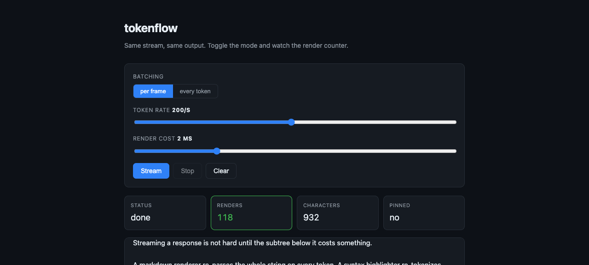

# tokenflow

[](https://github.com/orangec-at/tokenflow/actions/workflows/ci.yml)

React hooks for streaming text UIs. Three small pieces that keep a token stream
from turning into a render storm, a scroll fight, or a lost last sentence.

```bash
npm i tokenflow
```

No dependencies. React 18+. ESM and CJS. ~3 kB min+gzip.

---

## Why

Rendering an LLM response is not hard until it is. The three things that break
in production, in the order people hit them:

1. **One render per token.** `setText(prev => prev + chunk)` on every chunk is
   fine until the subtree below it costs something — markdown, syntax
   highlighting, math, a virtualized list. Then you drop frames.
2. **The scroll fights the reader.** Pinning with `scrollTop = scrollHeight` on
   every update yanks the view back down the moment someone scrolls up to
   re-read a paragraph.
3. **The last sentence disappears.** The final event arrives without a trailing
   blank line, or sits in a buffer that never gets flushed, and the answer ends
   mid-word.

`tokenflow` is the three fixes, each usable on its own.

## The batching claim, stated honestly

**React 18 already auto-batches state updates inside the same tick.** A
synchronous `for` loop of `setState` calls collapses into one render without
any help, and a library claiming otherwise is selling you something.

A network stream does not behave that way. Every `await reader.read()` resolves
in its own task, so React commits each token separately. That is the gap this
closes — and it only pays off when tokens arrive faster than frames.

Numbers from `pnpm bench` (render counts, not milliseconds, so they reproduce):

| Stream rate | Renders without batching | With per-frame batching | Reduction |
|---|---|---|---|
| ~1000 tok/s (60 per frame) | 301 | 6 | **98.0%** |
| ~300 tok/s (5 per frame) | 301 | 61 | **79.7%** |
| ~60 tok/s (1 per frame) | 121 | 121 | **0%** |

Read the last row first. At one token per frame there is nothing to batch, and
the hook does not pretend otherwise — it costs nothing and saves nothing.
**If your tokens arrive slower than the display refreshes, you do not need
this.** The visible output is byte-identical in every case; the benchmark
asserts that.

## Demo

```bash
cd example && pnpm install && pnpm dev
```



Mock stream, no API key. Toggle batching, change the token rate, add artificial
render cost, and watch the counter. Scroll up mid-stream to see the view stop
following.

---

## `useStreamingText`

Buffers chunks and commits them at most once per animation frame.

```tsx
import { useStreamingText } from 'tokenflow'

function Answer({ stream }: { stream: AsyncIterable<string> }) {
  const { text, push, flush } = useStreamingText()

  useEffect(() => {
    let cancelled = false
    ;(async () => {
      for await (const chunk of stream) {
        if (cancelled) return
        push(chunk)
      }
      flush() // commit the tail — without this the last tokens stay buffered
    })()
    return () => {
      cancelled = true
    }
  }, [stream, push, flush])

  return <Markdown>{text}</Markdown>
}
```

| Option | Default | |
|---|---|---|
| `initialText` | `''` | Text to start from. |
| `mode` | `'frame'` | `'immediate'` commits on every chunk. Useful for A/B-ing the difference in your own app. |

Returns `{ text, push, flush, reset, commitCount, getText }`.

`getText()` reads the committed text synchronously. `text` is state, so it still
holds the previous value in a callback that runs in the same tick as `flush()`.

## `useStickToBottom`

Follows new content, and stops the moment the reader scrolls away.

```tsx
import { useStickToBottom } from 'tokenflow'

function Thread({ children }) {
  const { ref, isPinned, scrollToBottom } = useStickToBottom<HTMLDivElement>()

  return (
    <div style={{ position: 'relative' }}>
      <div ref={ref} style={{ overflowY: 'auto', height: 400 }}>
        <div>{children}</div>
      </div>
      {!isPinned && (
        <button onClick={() => scrollToBottom('smooth')}>Jump to latest</button>
      )}
    </div>
  )
}
```

Growth is detected with a `ResizeObserver` on the container and on every direct
child, not a render count, so late-loading images and fonts that change height
after the text committed are handled too. A `MutationObserver` keeps the observed
set in step as messages are added and removed — watching only the first child
misses a chat that mounts empty and a chat that grows by adding siblings.

A smooth `scrollToBottom()` passes through positions that are not the bottom
yet, so those frames are ignored while it settles. The reader's own input
(`wheel`, `touchstart`, `pointerdown`, `keydown`) ends that guard immediately,
because someone who scrolls away mid-animation has to be able to unpin.

Pinning is decided by **position**, not by tracking which scrolls were ours.
A flag that consumes "the next scroll event" breaks the first time a
programmatic scroll produces no event — for example setting `scrollTop` to the
value it already has — and then silently swallows the reader's next scroll.
Comparing distance-to-bottom is self-correcting. The only exception is a smooth
scroll, which passes through positions that are not the bottom yet; those frames
are ignored until it lands.

| Option | Default | |
|---|---|---|
| `threshold` | `24` | Pixels from the bottom that still count as pinned. Not `0`: browsers report fractional scroll positions at some zoom levels and it flickers. |
| `initialPinned` | `true` | Start following. |
| `behavior` | `'auto'` | Used when the hook scrolls for you. |

## `useTextStream`

`fetch` + SSE + the two hooks above, wired together.

```tsx
import { useTextStream } from 'tokenflow'

function Chat() {
  const { text, status, error, start, stop } = useTextStream({
    // OpenAI-style deltas
    selectText: (e) => {
      if (e.data === '[DONE]') return false
      return JSON.parse(e.data).choices[0]?.delta?.content ?? null
    },
  })

  return (
    <>
      <button onClick={() => start('/api/chat', { method: 'POST', body })}>
        Send
      </button>
      {status === 'streaming' && <button onClick={stop}>Stop</button>}
      <p>{text}</p>
      {error && <p role="alert">{error.message}</p>}
    </>
  )
}
```

`selectText` returns the text to append, `null` to ignore the event, or `false`
to end the stream. The default treats `data` as the text and `[DONE]` as the
terminator, so a plain `data: hello` stream needs no configuration.

| Option | Default | |
|---|---|---|
| `selectText` | `data`, ends on `[DONE]` | Pull text out of one event. |
| `retries` | `2` | Reconnect attempts. See below. |
| `retryDelayMs` | `500` | Base for exponential backoff. |
| `mode` | `'frame'` | Passed to `useStreamingText`. |

**Retries only fire before the first token renders.** Once text is on screen,
reconnecting would replay it from the beginning and duplicate it, so a
mid-stream failure surfaces as an error and keeps what the reader already saw.
That is a deliberate trade: correct output over an invisible recovery.

`status` moves through `idle → streaming → done | aborted | error`.

## `SSEParser`

The wire-format parser, exported on its own if you have your own transport.

```ts
import { SSEParser } from 'tokenflow'

const parser = new SSEParser()
for (const event of parser.push(chunk)) { /* … */ }
for (const event of parser.flush()) { /* the trailing, unterminated one */ }
```

Network chunks do not respect message boundaries — one chunk can carry half an
event and one event can span three chunks — so the parser keeps a carry buffer.
Handles `event`, `data`, `id`, `retry`, comment lines, multi-line `data`, and
both `\n` and `\r\n`.

---

## Is this the right tool?

**Reach for the [Vercel AI SDK](https://sdk.vercel.ai) instead** if you want the
whole chat stack: provider adapters, tool calling, message history, server
helpers. It is a bigger, more capable thing and this does not replace it.

`tokenflow` is for the case where you already have a stream and you want the
rendering side to behave. It is headless, has no opinion about your transport
or your provider, and each hook is independently useful. If your app already
streams from somewhere and the problem is frames or scroll, this is the smaller
tool.

**Do not reach for either** if your tokens arrive slower than ~60/s and your
message subtree is cheap. Plain `useState` is fine and you should keep it.

## Development

```bash
pnpm install
pnpm test        # 56 tests
pnpm bench       # render-count comparison
pnpm typecheck
pnpm build
```

### A note on how the scroll hook got its shape

Two of the tests in `useStickToBottom.strict.test.tsx` exist because the unit
tests passed while the demo was visibly broken.

The listener was attached by the callback ref and removed by an effect cleanup.
That reads fine, and every hook-level test agreed. But StrictMode runs effects
setup → cleanup → setup, so in development the cleanup stripped the listener,
and the ref — whose identity had not changed — was never called again to put it
back. Scrolling silently stopped unpinning.

`renderHook` missed it because it calls `ref(node)` manually *after* mount, so
the cleanup had already run against nothing. Reproducing it needed the real
ordering: ref during commit, effects after. The fix was to stop splitting
ownership — the callback ref now attaches and detaches, and there is no effect
at all, because React always calls a callback ref with `null` on unmount.

## License

MIT © Jaeil Lee
